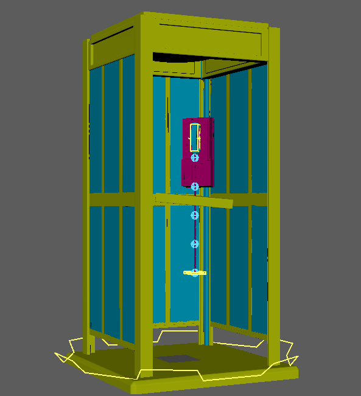

# Sample files

## Overview
---

- **asset_models** - directory that contains models required for rig build. When running build for first time a file dialog will pop up asking for a model file. Navigate to this folder and select required .ma file. As alternative, you can set model before running a build by pressing on a folder button next to model path field located at builder's workspace widget.
- **python_builds** - rigs build scripts that use Luna's Python API. Can be run directly from Maya's script editor or external IDE over command port.
- **rigging_project** - luna rigging project. Use builder dialog and set current project to this folder before running any rig builds. Running build from rig graph also required asset to be set prior to graph execution.

## Instructions (python build)
---
- Have luna_plugin loaded via Maya's plugin manager.
- Open Builder dialog from Luna menu.
- Set project to *rigging_project* directory
- Open rig file in Maya's script editor and execute.
  
## Instructions (graph build)
---
- Have luna_plugin loaded via Maya's plugin manager.
- Open Builder dilaog from Luna menu.
- Set project to rigging_project directory.
- Set current asset by typing it's name into "Asset name" field. (Ninja, Pawn, PhoneBox)
- Navigate to builder's file menu, press ***Open build*** and select existing build file.
- Navigate to builders's graph menu, press ***Execute*** (F5 shortcut, when builder is focused).

## Included rigs
---

